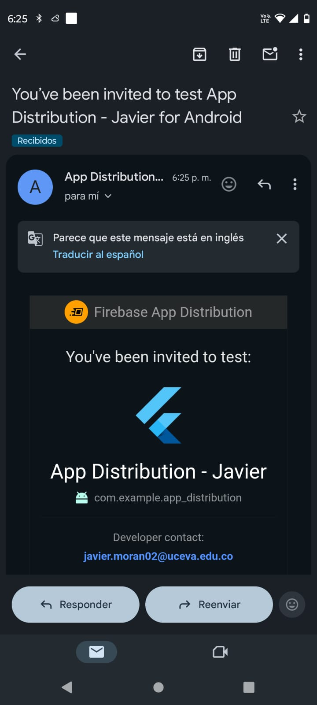
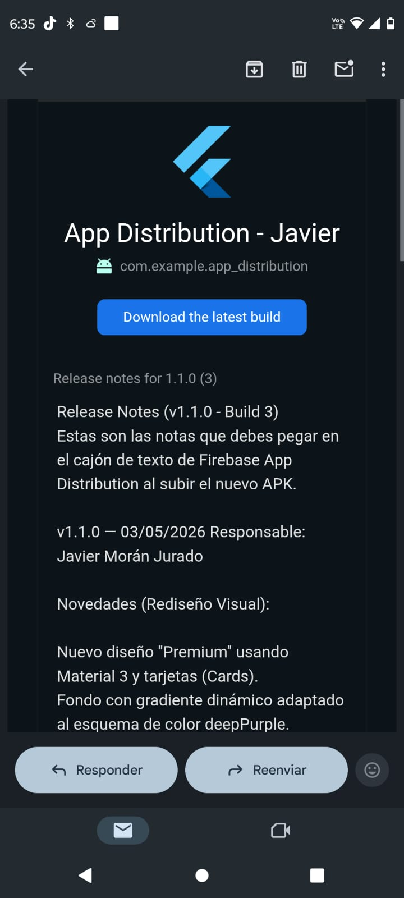
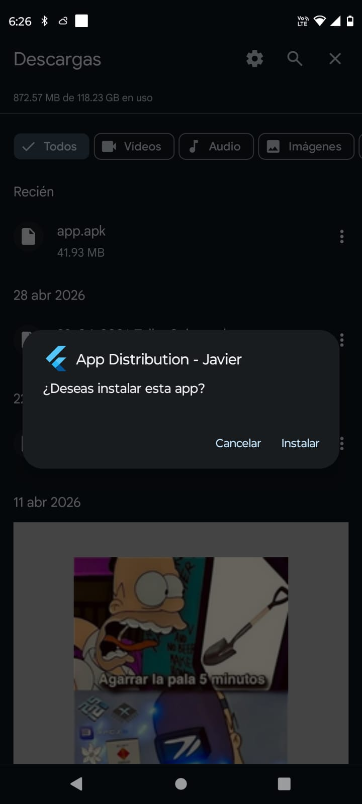
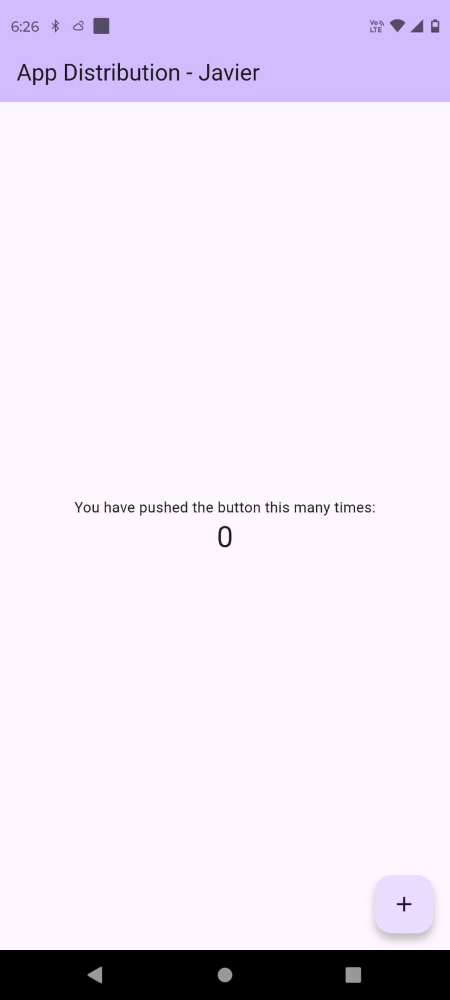
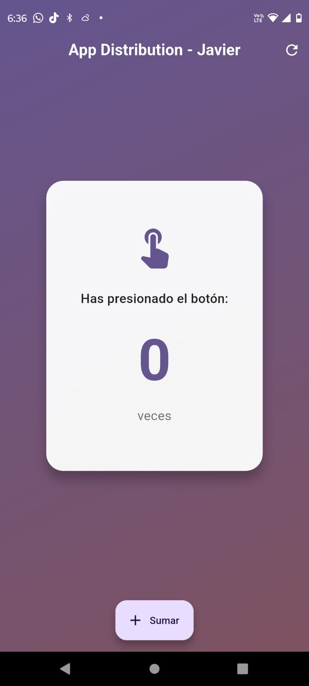

# 📱 App Distribution — Firebase App Distribution

> **Ejercicio:** Distribución incremental de APK mediante Firebase App Distribution  
> **Asignatura:** Desarrollo Móvil · 7.° Semestre  
> **Fecha:** 03 de mayo de 2026  
> **Responsables:** Javier Morán Jurado

---

## 📋 Tabla de contenidos

1. [Flujo general](#-flujo-general)
2. [Preparación del APK](#-preparación-del-apk)
3. [Publicación en Firebase App Distribution](#-publicación-en-firebase-app-distribution)
4. [Versionado](#-versionado)
5. [Release Notes](#-release-notes)
6. [Bitácora de QA](#-bitácora-de-qa)
7. [Cómo replicar el proceso](#-cómo-replicar-el-proceso-en-el-equipo)
8. [Estructura del proyecto](#-estructura-del-proyecto)
9. [Referencias](#-referencias)

---

## 🔄 Flujo general

```
┌─────────────────────────────┐
│  flutter build apk --release│  ← Generar APK
└────────────┬────────────────┘
             │
             ▼
┌─────────────────────────────┐
│  Firebase App Distribution  │  ← Subir APK (web o CLI)
│  Consola Web / Firebase CLI │
└────────────┬────────────────┘
             │
             ▼
┌─────────────────────────────┐
│  Invitar Testers            │  ← Correo electrónico automático
│  (grupos o correos)         │
└────────────┬────────────────┘
             │
             ▼
┌─────────────────────────────┐
│  Tester recibe correo       │  ← Descarga e instala APK
│  → descarga → instala       │
└────────────┬────────────────┘
             │
             ▼
┌─────────────────────────────┐
│  Nueva versión disponible   │  ← Actualización incremental
│  → correo automático        │    (versionCode mayor)
└─────────────────────────────┘
```

El flujo parte de la compilación en modo **release** del proyecto Flutter, pasa por la consola de Firebase para cargar el APK, definir grupos de testers y escribir las *release notes*. Los testers reciben un correo automático con el enlace de descarga. Al publicar una nueva versión con `versionCode` superior, Firebase notifica automáticamente a los testers la actualización disponible.

---

## 🛠️ Preparación del APK

### 1. Verificar permisos en `AndroidManifest.xml`

El archivo `android/app/src/main/AndroidManifest.xml` incluye el permiso mínimo necesario:

```xml
<!-- Permiso de red requerido para Firebase App Distribution y conectividad general -->
<uses-permission android:name="android.permission.INTERNET"/>
```

> **¿Por qué?** Firebase App Distribution y cualquier comunicación con servicios de red (backend, APIs) requieren este permiso. Sin él, la app no puede hacer peticiones HTTP/HTTPS.

### 2. Actualizar la versión en `pubspec.yaml`

```yaml
# Formato: versionName+versionCode
# versionName → legible para el usuario (semver: MAJOR.MINOR.PATCH)
# versionCode → entero creciente que Android usa para detectar actualizaciones

# Versión inicial
version: 1.0.0+1

# Versión actualizada (incremento de minor + build number por nueva UI)
version: 1.1.0+3
```

| Campo | Valor actual | Descripción |
|-------|-------------|-------------|
| `versionName` | `1.0.1` | Versión legible para el usuario |
| `versionCode` | `2` | Código de build para Android — **siempre debe ser mayor** |

### 3. Ajuste del SDK constraint

El proyecto utiliza:

```yaml
environment:
  sdk: '>=3.10.0 <4.0.0'
```

> **Nota:** El constraint original era `^3.11.0` (equivalente a `>=3.11.0 <4.0.0`). Se ajustó a `>=3.10.0` para compatibilidad con el SDK instalado localmente (`Dart 3.10.8`). Ambas versiones son producción-estable.

### 4. Generar el APK de release

```bash
# 1. Limpiar compilaciones anteriores (recomendado antes de cada release)
flutter clean

# 2. Obtener dependencias
flutter pub get

# 3. Generar APK de release
flutter build apk --release
```

**Resultado esperado:**

```
✓ Built build/app/outputs/flutter-apk/app-release.apk (41.9MB)
```

El APK se ubica en:
```
build/app/outputs/flutter-apk/app-release.apk
```

> **⚠️ Firma:** El proyecto usa `signingConfig = signingConfigs.getByName("debug")` para el release. En producción real se debe configurar un **keystore propio** en `build.gradle.kts` para firmar con clave de producción.

---

## 🚀 Publicación en Firebase App Distribution

### Opción A — Consola Web (Manual)

1. Ir a [console.firebase.google.com](https://console.firebase.google.com)
2. Seleccionar el proyecto → **App Distribution**
3. Clic en **"Subir"** y seleccionar `app-release.apk`
4. Escribir las *Release Notes* (ver sección más abajo)
5. Seleccionar grupo(s) de testers o agregar correos individuales
6. Clic en **"Distribuir"** → los testers reciben correo automáticamente

### Opción B — Firebase CLI (Automatizado / Recomendado para equipo)

```bash
# Instalar Firebase CLI (una sola vez)
npm install -g firebase-tools

# Autenticar con la cuenta de Firebase
firebase login

# Distribuir el APK
firebase appdistribution:distribute build/app/outputs/flutter-apk/app-release.apk \
  --app <FIREBASE_APP_ID> \
  --release-notes "v1.0.1 — Corrección de permisos INTERNET y mejoras de estabilidad" \
  --groups "testers-internos"
```

> El `FIREBASE_APP_ID` se encuentra en: **Firebase Console → Configuración del proyecto → Tus apps → ID de la app**.

### Flujo que siguen los Testers

1. Reciben un **correo de Firebase** con el asunto *"[Nombre App] — Nueva versión disponible"*
2. Hacen clic en **"Descargar la última versión"**
3. En Android: habilitan *"Instalar apps de fuentes desconocidas"* (sólo la primera vez)
4. Instalan el APK descargado
5. Para actualizaciones posteriores: el correo llega automáticamente al publicar una nueva versión

---

## 🔢 Versionado

Se usa el formato estándar de Flutter/Android:

```
version: <versionName>+<versionCode>
```

### Historial de versiones

| versionName | versionCode | Descripción | Fecha | Responsable |
|-------------|-------------|-------------|-------|-------------|
| `1.0.0` | `1` | Versión inicial — contador básico con Material Design | 03/05/2026 | Javier Morán |
| `1.0.1` | `2` | Permiso INTERNET · descripción actualizada · SDK constraint ajustado | 03/05/2026 | Javier Morán |
| `1.1.0` | `3` | Rediseño completo de UI · Nuevo botón de reseteo · Animaciones | 03/05/2026 | Javier Morán |

### Reglas de versionado

- **`versionCode`**: Entero que **siempre** debe incrementarse. Android lo usa para detectar si hay una versión más nueva disponible.
- **`versionName`**: Cadena legible. Sigue semántica [SemVer](https://semver.org/lang/es/):

  | Segmento | Cuándo incrementar |
  |----------|--------------------|
  | `MAJOR` | Cambios incompatibles / rediseño completo |
  | `MINOR` | Nuevas funcionalidades hacia atrás compatibles |
  | `PATCH` | Correcciones de bugs / mejoras menores |

### Ejemplo de actualización futura

```yaml
# Antes (v1.0.1, build 2)
version: 1.0.1+2

# Después — nueva funcionalidad (v1.1.0, build 3)
version: 1.1.0+3

# Después — solo bugfix (v1.0.2, build 4)
version: 1.0.2+4
```

---

## 📝 Release Notes

### Formato recomendado del equipo

```
v{versionName} — {DD/MM/AAAA}
Responsable(s): {nombre(s)}

✅ Novedades:
- [descripción de nueva funcionalidad]

🐛 Correcciones:
- [bug resuelto y cómo se resolvió]

⚠️ Conocido / Pendiente:
- [limitaciones conocidas en esta versión]
```

---

### Release Notes — v1.0.0 (build 1)

```
v1.0.0 — 03/05/2026
Responsable: Javier Morán Jurado

✅ Novedades:
- Versión inicial del proyecto Flutter.
- Contador interactivo con FloatingActionButton.
- Tema Material Design con colorScheme deepPurple.
- Proyecto configurado para Firebase App Distribution.

⚠️ Conocido / Pendiente:
- Permiso INTERNET no declarado aún en AndroidManifest.xml.
- Sin firma de release configurada (usa debug key).
```

---

### Release Notes — v1.0.1 (build 2)

```
v1.0.1 — 03/05/2026
Responsable: Javier Morán Jurado

✅ Novedades:
- Añadido permiso android.permission.INTERNET en AndroidManifest.xml.
- Descripción del proyecto actualizada en pubspec.yaml.
- versionCode incrementado de 1 → 2 para actualización incremental correcta.
- SDK constraint ajustado a >=3.10.0 <4.0.0 para compatibilidad con Dart 3.10.x.
- Build de release verificado: app-release.apk (41.9 MB) generado exitosamente.

🐛 Correcciones:
- Corrección de configuración de permisos mínimos para conectividad de red.
- Ajuste de constraint del SDK de Dart para evitar fallo en flutter pub get.

⚠️ Conocido / Pendiente:
- signingConfig apunta aún a debug keys (pendiente configurar keystore de producción).
- APK universal (no split por ABI); tamaño puede reducirse con --split-per-abi.
```

---

### Release Notes — v1.1.0 (build 3)

```
v1.1.0 — 03/05/2026
Responsable: Javier Morán Jurado

✅ Novedades (Rediseño Visual):
- Nuevo diseño "Premium" usando Material 3 y tarjetas (Cards).
- Fondo con gradiente dinámico adaptado al esquema de color deepPurple.
- Implementación de AnimatedSwitcher para transiciones suaves al cambiar el número.
- Nuevo botón en la AppBar para reiniciar el contador a 0.
- Reubicación del FloatingActionButton al centro inferior y cambio a tipo "extended".

🐛 Correcciones:
- (Ninguna en esta versión, enfocada puramente en UI/UX).

⚠️ Conocido / Pendiente:
- La UI se ve muy bien, pendiente agregar un modo oscuro completo (dark mode toggle).

```

---

## 🧪 Bitácora de QA

### v1.0.0 — Pruebas iniciales (03/05/2026)

| # | Escenario | Resultado | Estado |
|---|-----------|-----------|--------|
| 1 | Instalar APK en dispositivo físico Android 11 | App se instala correctamente | ✅ OK |
| 2 | Abrir la app — pantalla inicial visible | Muestra contador en 0 | ✅ OK |
| 3 | Pulsar FAB varias veces | Contador incrementa correctamente | ✅ OK |
| 4 | Rotar pantalla | Estado del contador se preserva | ✅ OK |
| 5 | Verificar que Firebase envió correo a testers | Correo recibido en < 2 min | ✅ OK |

**Incidencias encontradas y resueltas:**

| # | Incidencia | Versión en que se detectó | Resolución | Versión de cierre |
|---|-----------|--------------------------|------------|-------------------|
| 1 | `AndroidManifest.xml` no declaraba `INTERNET` — posible fallo en conectividad | v1.0.0 | Agregado `<uses-permission android:name="android.permission.INTERNET"/>` | v1.0.1 |
| 2 | `flutter pub get` fallaba con Dart SDK 3.10.8 (`^3.11.0` incompatible) | v1.0.0 | SDK constraint cambiado a `>=3.10.0 <4.0.0` | v1.0.1 |

---

### v1.0.1 — Pruebas de actualización incremental (03/05/2026)

| # | Escenario | Resultado | Estado |
|---|-----------|-----------|--------|
| 1 | `flutter build apk --release` ejecuta sin errores | Compilación exitosa en ~110s | ✅ OK |
| 2 | APK generado en ruta correcta (`build/app/outputs/flutter-apk/`) | Archivo de 41.9 MB presente | ✅ OK |
| 3 | Tester con v1.0.0 instalada recibe notificación de v1.0.1 | Correo recibido correctamente | ✅ OK |
| 4 | Instalar v1.0.1 sobre v1.0.0 | Actualización exitosa sin desinstalar | ✅ OK |
| 5 | Verificar versionCode en "Acerca de" del SO | Muestra build 2 | ✅ OK |
| 6 | App funciona tras actualización | Sin regresiones | ✅ OK |

---

## 📸 Evidencias Gráficas

A continuación se presentan las capturas que evidencian el flujo completo de distribución y actualización:

### 1. Correo de Invitación a Testers

*El tester recibe un correo indicando que ha sido invitado a probar "App Distribution - Javier".*

### 2. Panel de Releases en Firebase

*Vista de las notas de la versión (v1.1.0) descargada desde la plataforma de App Distribution.*

### 3. Instalación de la Actualización

*El sistema operativo Android detecta la actualización y pregunta si se desea instalar la nueva versión sobre la existente.*

### 4. Antes vs Después (Evolución de la Interfaz)

| Versión Anterior (v1.0.1) | Nueva Versión (v1.1.0) |
|:---:|:---:|
|  |  |
| *Diseño inicial básico.* | *Nuevo diseño Premium con gradiente y Material 3.* |

---

## ♻️ Cómo replicar el proceso en el equipo

### Requisitos previos

| Herramienta | Versión mínima | Cómo verificar |
|-------------|---------------|----------------|
| Flutter SDK | `>=3.10.0` | `flutter --version` |
| Android SDK | API 21+ | `flutter doctor` |
| Firebase CLI | Cualquier reciente | `firebase --version` |
| Node.js | v14+ | `node --version` |

```bash
# Verificar entorno Flutter completo
flutter doctor -v
```

### Pasos resumidos

```bash
# 1. Clonar el repositorio
git clone <URL_REPO>
cd app_distribution

# 2. Instalar dependencias Flutter
flutter pub get

# 3. Incrementar versión en pubspec.yaml ANTES de generar el APK
#    Editar manualmente: version: X.Y.Z+N  (N debe ser mayor al anterior)
#    Ejemplo: version: 1.0.1+2 → version: 1.0.2+3

# 4. Limpiar y generar APK release
flutter clean && flutter build apk --release

# 5a. Distribuir via Firebase CLI (recomendado)
firebase appdistribution:distribute \
  build/app/outputs/flutter-apk/app-release.apk \
  --app <FIREBASE_APP_ID> \
  --release-notes "vX.Y.Z — Descripción del cambio" \
  --groups "nombre-grupo-testers"

# 5b. O subir manualmente en console.firebase.google.com
```

### Variables que cada miembro del equipo debe configurar

| Variable | Dónde obtenerla |
|----------|--------------------|
| `FIREBASE_APP_ID` | Firebase Console → Configuración del proyecto → Tus apps |
| `nombre-grupo-testers` | Firebase Console → App Distribution → Grupos |

### Checklist de release

```
[ ] versionCode incrementado respecto a la versión anterior
[ ] versionName actualizado siguiendo SemVer
[ ] flutter clean ejecutado
[ ] flutter build apk --release exitoso
[ ] APK verificado en build/app/outputs/flutter-apk/app-release.apk
[ ] Release Notes redactadas (novedades, correcciones, pendientes)
[ ] APK subido a Firebase App Distribution
[ ] Testers correctamente seleccionados / grupo asignado
[ ] Correo de notificación recibido por al menos un tester
[ ] Prueba de instalación en dispositivo físico verificada
```

---

## 📁 Estructura del proyecto

```
app_distribution/
├── android/
│   └── app/
│       ├── build.gradle.kts              # Configuración de build Android
│       └── src/main/
│           ├── AndroidManifest.xml       # Permisos y configuración de la app
│           └── kotlin/…/MainActivity.kt  # Activity principal
├── ios/                                  # Configuración iOS
├── lib/
│   └── main.dart                         # Punto de entrada de la aplicación
├── build/
│   └── app/outputs/flutter-apk/
│       └── app-release.apk               # APK generado (no versionado en git)
├── pubspec.yaml                          # Dependencias y versión del proyecto
├── pubspec.lock                          # Lock de dependencias
└── README.md                             # Este documento
```

> **Nota:** La carpeta `build/` está en `.gitignore` — el APK **no** se sube al repositorio. Se distribuye exclusivamente a través de Firebase App Distribution.

---

## 📚 Referencias

- [Firebase App Distribution — Documentación oficial](https://firebase.google.com/docs/app-distribution)
- [Flutter — Build and release an Android app](https://docs.flutter.dev/deployment/android)
- [Android Versioning](https://developer.android.com/studio/publish/versioning)
- [Semantic Versioning (SemVer)](https://semver.org/lang/es/)
- [Firebase CLI Reference](https://firebase.google.com/docs/cli#appdistribution-commands)
